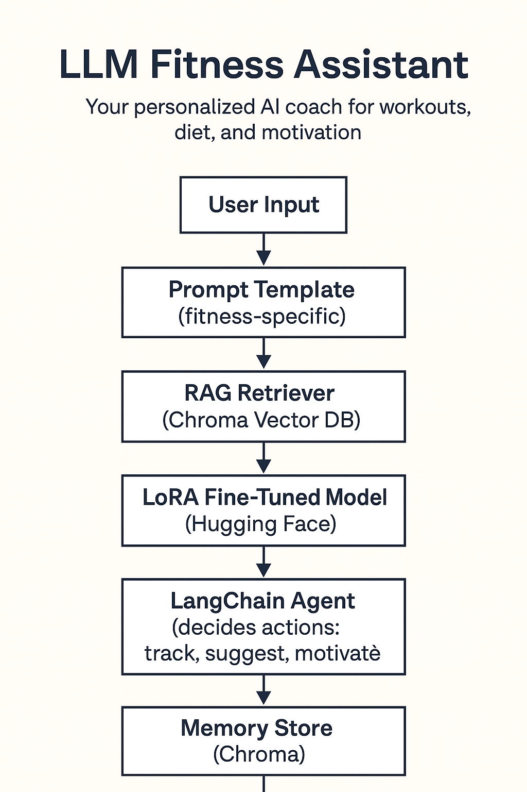

<p align="center">
  
</p>

<h1 align="center">🏋️‍♂️ LLM Fitness Assistant</h1>
<p align="center">Your personalized AI coach for workouts, diet, and motivation — powered by LLMs.</p>


This assistant helps users track workouts, manage diet, and stay motivated — combining LangChain, LoRA fine-tuning, and Chroma vector search for intelligence and memory.


---
## 🚀 Live Demo

👉 Try it here: [Hugging Face Space Link](https://huggingface.co/spaces/sam351/llm-fitness-assistant)

---


🧠 Overview


The LLM Fitness Assistant blends modern AI techniques to simulate a real fitness coach:


💬 Conversational interaction — natural language input for workouts and meals  

🔍 RAG (Retrieval-Augmented Generation) — fetches up-to-date fitness and nutrition data  

🧩 LoRA fine-tuning — adapts the base model’s tone and behavior to act like a coach  

🧠 Memory (via Chroma) — remembers user goals, progress, and preferences  

⚙ FastAPI backend — lightweight, scalable REST API for serving responses  


---


🏗️ System Architecture


```text

User Input

&nbsp;  ↓

Prompt Template (Fitness-specific)

&nbsp;  ↓

RAG Retriever (Chroma Vector DB)

&nbsp;  ↓

LoRA Fine-Tuned Model (Hugging Face Transformers)

&nbsp;  ↓

LangChain Agent (decides actions: track, suggest, motivate)

&nbsp;  ↓

Memory Store (Chroma)

&nbsp;  ↓

FastAPI Endpoint → JSON Response
```


🚀 Quick Start


1️⃣ Clone the Repository
```bash
git clone https://github.com/samfash/llm-fitness-assistant.git
cd llm-fitness-assistant
 ```

2️⃣ Install Dependencies
 ```
pip install -r requirements.txt
 ```

3️⃣ Set Environment Variables

Create a .env file in the project root:
 ```
HUGGINGFACE_API_KEY=your_huggingface_token
CHROMA_PATH=./chroma_db
 ```

4️⃣ Run the FastAPI Server
 ```
uvicorn app:api/api_server --reload
 ```


Then visit 👉 http://127.0.0.1:8000/docs
 for the Swagger UI.


🧩 Example API Usage

Request
 ```
POST /query
{
  "user_input": "Plan my workout for the next 3 days focused on strength training."
}
 ```

Response
 ```
{
  "response": "Here's a 3-day strength training plan: Day 1 - Push (Chest/Triceps)..."
}
 ```
⚡ Run the UI

Once your FastAPI backend is running (uvicorn app:app --reload):

Open another terminal:
```
streamlit run ui.py
```

Then go to:
👉 http://localhost:8501
---
🧰 Tech Stack
Component	Tool
LLM Orchestration	LangChain

Model	Hugging Face LoRA fine-tuned model
Vector Database	ChromaDB

API Framework	FastAPI

Memory & RAG	LangChain + Chroma retriever
Environment	Python 3.11+
---
🧪 Development Notes

LoRA fine-tuning is done on a base instruction model (e.g., mistralai/Mistral-7B-Instruct or falcon-7b).

Chroma stores embeddings of user logs, nutrition data, and workout templates.

FastAPI serves as the interface for both a frontend app and other systems (e.g., mobile or chatbot UI).

---
🧩 Future Improvements

Integrate progress visualization dashboard (Streamlit)

Add reminder agent for workout schedules

Support multimodal inputs (e.g., food photo → calorie estimation)

🧑‍💻 Example Prompt Template
 ```
You are a friendly and motivating fitness assistant.
You help users track workouts, plan meals, and stay consistent.
Use the retrieved context to make informed recommendations.

Context:
{retrieved_data}

User Query:
{user_input}
 ```
---
📄 License

MIT License © 2025 [Samuel Fasanya](https://fashrockweb.vercel.app/)

📫 Connect: [LinkedIn](https://www.linkedin.com/in/samuel-fasanya-b9ba41112/)


